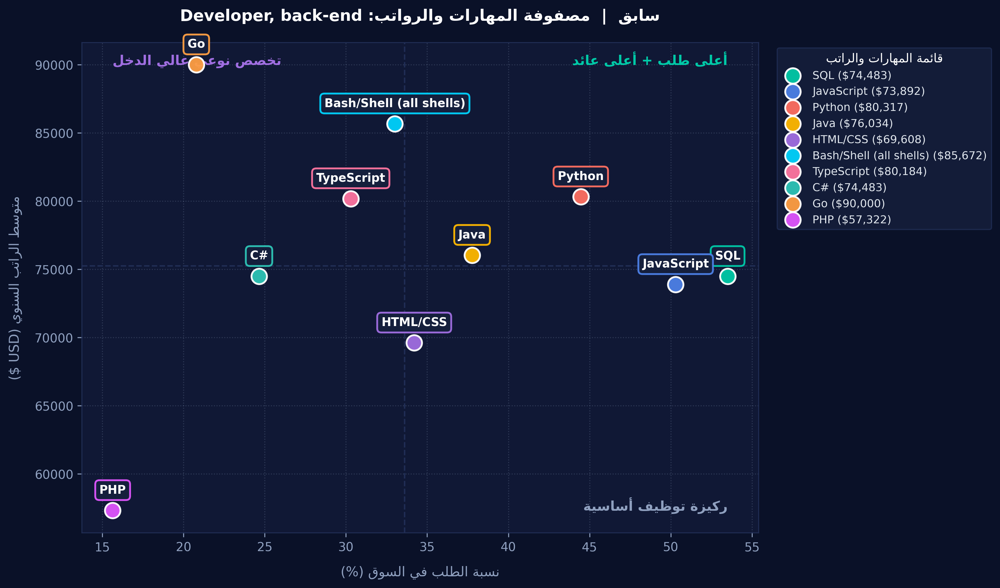

<div align="center">

# 🧭 سابق | Sabiq: Smart Career & Tech-Stack Architect 🚀


<p align="center">
  
</p>

*نظام ذكي لتحليل سوق العمل البرمجي وتوجيه المطورين والطلاب لبناء مساراتهم المهنية بالأرقام والذكاء الاصطناعي، بالاعتماد على استبيان مطوري Stack Overflow العالمي (+76 ألف مطور).*

---

</div>

## 📌 عن المشروع
يواجه طلاب وخريجو علوم الحاسب وهندسة البرمجيات تشتتاً مستمراً عند اختيار التقنيات والمسارات الوظيفية؛ حيث تعتمد أغلب النصائح على آراء فردية عامة. يهدف **"سابق"** إلى تحويل البيانات الضخمة إلى قرارات مهنية واضحة، مع تقديم توقع مالي دقيق وخطة عمل مؤتمتة بضغطة زر.

---

## ✨ أبرز المميزات (Key Features)

### 1️⃣ معالجة البيانات والواجهة التفاعلية (Data Pipeline & UI)
* فلترة البيانات الضخمة لأكثر من 76 ألف سجل لاستخراج الرواتب، المسارات، وسنوات الخبرة.
* واجهة تفاعلية مرنة مبنية بـ `ipywidgets` لاختيار المسار الوظيفي وعرض تحليله فورياً.

### 2️⃣ مصفوفة المهارات البصرية (Visual Skill Matrix)
* تحليل التقنيات الأكثر طلباً وربطها بمتوسط الرواتب السنوية.
* إنتاج إنفوجرافيك ملون بنظام الأرباع يوضح المهارات الإلزامية للتوظيف والمهارات النوعية عالية الدخل.

<p align="center">
  
</p>

### 3️⃣ التنبؤ المالي بالذكاء الاصطناعي (Machine Learning Pipeline)
* تدريب نموذج انحدار غابات عشوائية (`RandomForestRegressor`) عبر مكتبة `scikit-learn`.
* تقييم دقة النموذج بمقاييس معيارية: $R^2$ Score، ومتوسط الخطأ المطلق (MAE)، ونسبة التنبؤات المقبولة ضمن هامش خطأ ±20%.
* حساب وزن وأهمية كل تقنية في رفع القيمة السوقية للمطور (`Feature Importance`).
* توفير محاكي حي لتوقع الراتب السنوي التقديري بناءً على المهارات وسنوات الخبرة[cite: 1].

### 4️⃣ أتمتة العرض التقديمي وخارطة الطريق (Deck Generation)
* توليد عرض تقديمي متكامل من 5 شرائح بصيغة PowerPoint (`career_roadmap.pptx`) بتصميم داكن احترافي عبر `python-pptx`[cite: 1].
* دمج نتائج الإنفوجرافيك، وتحليلات الذكاء الاصطناعي، وخطة عمل مرحلية، وترشيح أهم الدورات والشهادات العالمية المعتمدة لكل مهارة[cite: 1].

---

## 🏆 التكريم والإنجاز
حقق المشروع **المركز الثاني** في ختام معسكر نماذج تعلّم الآلة (Machine Learning Models Bootcamp)[cite: 3].

<p align="center">
  
</p>

---

## 🛠️ التقنيات والمكتبات المستخدمة (Tech Stack)

* **لغة البرمجة:** Python[cite: 1]
* **تحليل ومعالجة البيانات:** Pandas, NumPy[cite: 1]
* **تعلّم الآلة (Machine Learning):** Scikit-Learn[cite: 1]
* **الرسم البياني وتشكيل النصوص:** Matplotlib, Arabic-Reshaper, Python-Bidi[cite: 1]
* **الواجهة التفاعلية وأتمتة العروض:** Ipywidgets, Python-pptx[cite: 1]

---

## 🚀 طريقة التشغيل (Quick Start)

1. **استنساخ المستودع (Clone the Repository):**
   ```bash
   git clone [https://github.com/EngHaneena/Sabiq.git](https://github.com/EngHaneena/Sabiq.git)
   cd Sabiq
   تشغيل المفكرة:

تشغيل خلايا مفكرة AI_siyaq.ipynb بالتسلسل على Google Colab أو Jupyter Notebook[cite: 1].

📁 مخرجات المشروع (Deliverables)
AI_siyaq.ipynb: المفكرة البرمجية المتكاملة


skill_matrix.png: الإنفوجرافيك الملون لمصفوفة المهارات

career_roadmap.pptx: العرض التقديمي المؤتمت وخارطة الطريق المهنية

👥 فريق العمل
حنين القصير — معالجة البيانات والواجهة التفاعلية (Data Pipeline & UI)

وفاء — التحليل الإحصائي ومصفوفة المهارات البصرية (Visual Analytics)

أميرة — نماذج تعلّم الآلة وأتمتة العرض التقديمي (Machine Learning & Deck Automation)
